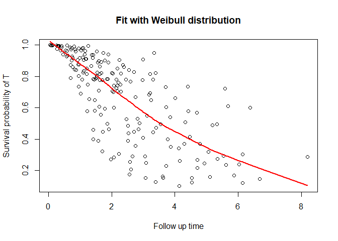

<!-- README.md is generated from README.Rmd. Please edit that file -->

# DepCens

<!-- badges: start -->
<!-- badges: end -->

Dependent censoring regression models for survival multivariate data.
These models are based on extensions of the frailty models, capable to
accommodating the dependence between failure and censoring times, with
Weibull and piecewise exponential marginal distributions.

## Installation

You can install the development version of DepCens from
[GitHub](https://github.com/) with:

``` r
#install.packages("devtools")
#devtools::install_github("GabrielGrandemagne/DepCens")
```

## Example

This is a basic example which shows you how to solve a common problem:

``` r
library(DepCens)
#KidneyMimic is our simulated data frame
delta_t <- ifelse(KidneyMimic$cens==1,1,0)
delta_c <- ifelse(KidneyMimic$cens==2,1,0)
fit <- dependent.censoring(formula = time ~ x1 + x2 | x3 + x1, data=KidneyMimic, delta_t=delta_t,
                           delta_c=delta_c, ident=KidneyMimic$ident, dist = "weibull")
summary_dc(fit)
#> 
#> Weibull approach
#> 
#> Name  Estimate    Std. Error  CI INF      CI SUP      p-value     
#> Alpha    1.388009    0.3922203   0.6192571   2.156761    0.0004019   
#> Sigma    0.6447018   0.2315937   0.1907782   1.098625    
#> 
#> Coefficients T:
#> 
#> Name  Estimate    Std. Error  CI INF      CI SUP      p-value     
#> x1   0.08098522  0.02080334  0.04021067  0.1217598   9.905e-05   
#> x2   -1.406800   0.2398661   -1.876938   -0.9366627  4.493e-09   
#> 
#> Coefficients C:
#> 
#> Name  Estimate    Std. Error  CI INF      CI SUP      p-value     
#> x3   0.230895    0.1888372   -0.1392259  0.601016    0.2214  
#> x1   0.1945837   0.03807359  0.1199595   0.2692079   3.209e-07   
#> 
#> ----------------------------------------------------------------------------------
#> 
#> Information criteria:
#> 
#> AIC   BIC      HQ    
#> 405.4663 435.1512 417.4793
```

You can also plot the survival function

``` r
plot_dc(fit, scenario = "t")
```


